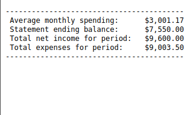
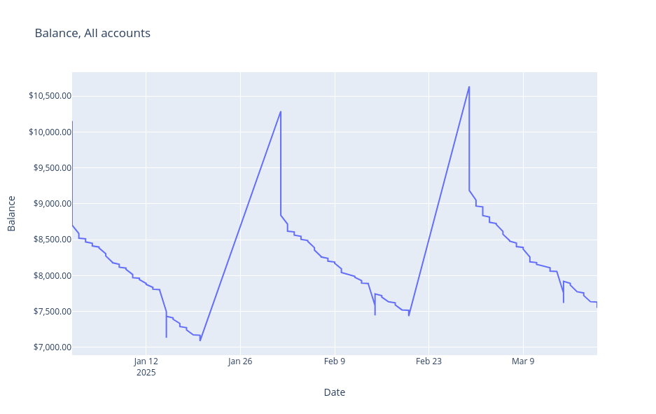
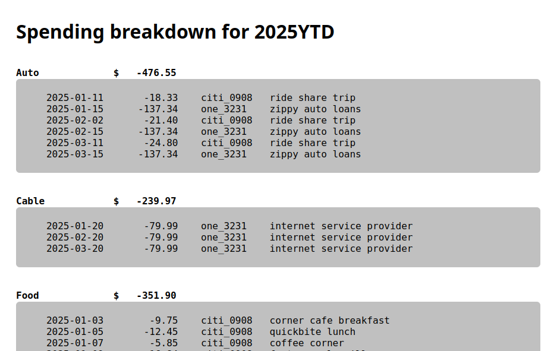
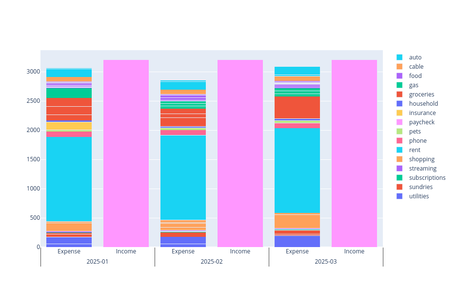

# mymoney

Keep track of the total balance of your accounts and your categorized monthly spending
in a semi-automated way. Afterward,
<a href="https://arkadianriver.github.io/mymoney/">visualize it in a series of reports</a>
(useful for seeing your year-to-date spending).

 
 

## Setup

Requires [Python 3.9 or later](https://wiki.python.org/moin/BeginnersGuide/Download).

1. Clone the repository, and from inside the repository folder, install it with:

       pip install .

   When installed with the system Python, the program `mymoney` is now available
   to run from a project directory anywhere on your computer.
   
1. In a folder of your choosing (outside this repository),
   create a project folder that contains a `config.yml` file. See the `test` folder for an example;
   it has a project folder for 2025 named `_2025`.
   Comments in the test `config.yml` describe the settings to use to describe the format
   of each of your institutions' CSV files.

## To use

After you set up a project folder and the `config.yml` for all of your accounts, periodically:

1. Decide the period this run pertains to and create an input folder for it. I use monthly periods.
   For example, I might create a `_2024/input/202404` folder for April in the `_2024` project.

1. From your banking websites, download the transactions as CSV files into that `{project_name}/input/{period}` folder.
   Be sure the files contain only the transactions for the period.

   For each bank you visit, also take note of the balance at the end
   of the period you're tracking and add it to the `current_balance`
   section of the `config.yml` file.

1. From the project folder, run:

        mymoney {period}

   As it reads each transaction, you'll be asked to (1) type a string that matches the transation
   with a regular exxpression and (2) the category for transactions that matches this one. Next
   time it runs across a matching description, it will automatically be assigned a category without asking.
   (The more you use it, the more automated it is.)

> [!TIP]
> If you use monthly periods like I do, named as `YYYYMM`, you can get the year-to-date aggregate of the monthly periods for that year, by running `mymoney <year>YTD`.

That's it! When it's done, the following visualizations will be in the
folder `{project_name}/{period}/reports`.

|Report|Description|
|---|---|
|`avg_and_balance.txt`|short summary of the total ending balance and average monthly spending (primarily useful for `YTD` periods)|
|`balance_{period}.html`|the total running balance of all your accounts as a line graph|
|`breakdown_{period}.[md\|html]`|transactions for the period, organized by category|
|`income_expenses_{period}.html`|a monthly spending bar chart, with a category breakdown in each bar|
|`transactions_{period}.[txt\|csv]`|sorted list of all transactions|

